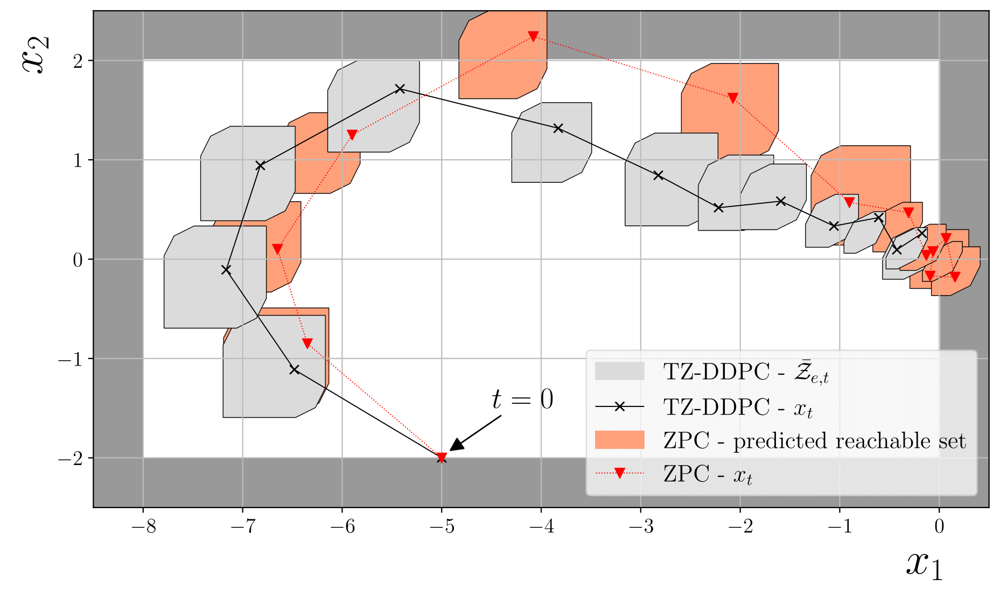
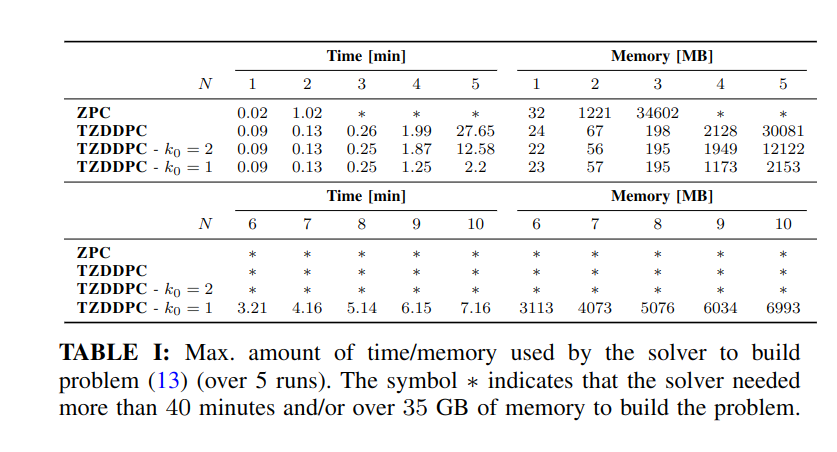

# TZDDPC - Tube-Based Zonotopic Data Driven Predictive Control

Code for the paper [_Tube-Based Zonotopic Data-Driven Predictive Control_](https://arxiv.org/abs/2209.03500).

_Author_: Alessio Russo (alessior@kth.se)
_License_: MIT

## Requirements

To run the examples you need the following libraries: `numpy scipy cvxpy dccp pyzpc pyzonotope matplotlib`

- The `PyZPC` library can be found [here](https://github.com/rssalessio/PyZPC)
- The `PyZonotope` library can be found [here](https://github.com/rssalessio/pyzonotope)

## Example

To run the example, run the file `1.double_integrator_sim.py` in the folder `examples`. 

  

## Computational complexity

To estimate the computational complexity, run the file `1.double_integrator_run_sim_computational_complexity.sh`, which will automatically run all the experiments. Use the notebook `1.double_integrator_results_computational_complexity.ipynb` to print the results.

  

## Other examples

Check also the example on a mechanical pulley `examples/2.pulley_sim.py` (4 dimensional) or on a 5-dimensional system `examples/3.5dimsystem_sim.py`.
